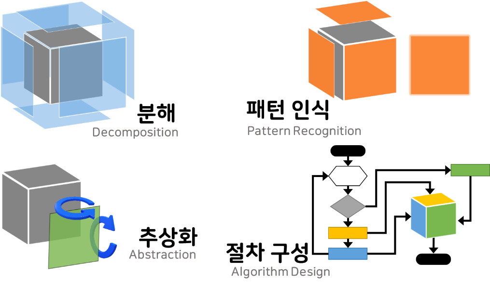

컴퓨터적 사고(Computational Thinking)는 문제를 기계가 풀 수 있도록 만들고, 문제의 답을 구하기 위한 절차를 만드는데 도움을 주는 생각 도구입니다.

{:class="center"}

* 소목차
{:toc}

# 컴퓨터적 사고의 목표
많은 사고 방식은 문제를 해결하여 답을 얻으려 합니다.
반면, 컴퓨터적 사고의 목표는 답이 아니라 답을 얻어내는 방법을 다룹니다.

컴퓨터적 사고는 복잡하거나 해결하는데 걸리는 시간이 오래 걸리는 문제들에 적합합니다. 가령 어떤 소설의 단어 수를 알기 위해서 복잡한 공식이 필요하지 않습니다. 책을 읽어가면서 단어를 셀 수 있지요. 하지만 빠르게 답을 얻으려면 컴퓨터를 사용해야 합니다. 단어들이 공백과 마침표, 쉼표로 구분된다는 사실을 알아낸다면 컴퓨터를 이용해서 손쉽게 알아낼 수 있습니다.

# 생각도구 간략하게 살펴보기
컴퓨터적 사고를 통해서 문제를 해결하기 위해서는 여러 생각도구들을 활용해야 합니다.

1. 문제를 해결하기 위해 필요한 정보를 수집하는 **데이터 수집**
1. 문제를 작은 조각으로 나누는 **분해**
1. 조각들의 규칙을 찾는 **패턴 인식**
1. 문제의 핵심만 간추리는 **추상화**
1. 비슷한 문제를 풀 수 있도록 만드는 **일반화**
1. 문제를 해결하는 절차를 만드는 **알고리즘 설계**
1. 결과를 표나 글, 그림으로 묘사하는 **표현**

반드시 여기서 소개하는 도구들을 모두 사용해야 할 필요는 없습니다.
반드시 이곳에 나열되어 있는 순서대로 도구를 사용할 필요도 없습니다.
