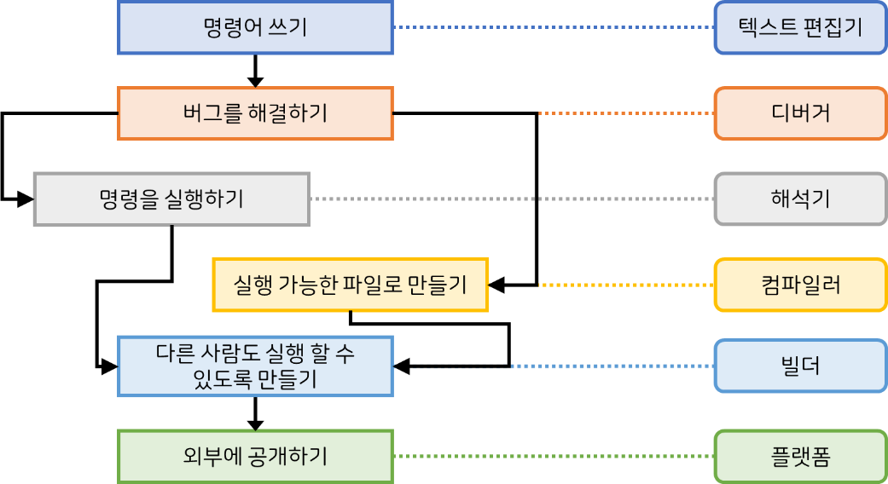

우리가 스마트 폰을 사용하면서 운영체제나 어플리케이션(앱) 등의 프로그램을 만나게 됩니다. 컴퓨터의 운영체제와 응용프로그램 또한 프로그램이고, 버스정류장에서 버스 노선과 도착예정시간을 알려주는 모니터에도 프로그램이 숨겨져 있습니다. 편의점에서 바코드를 찍어 가격을 확인하고, 카드를 사용해서 결재하는 동안에도 우리는 프로그램을 만납니다.

미리 명령을 입력해두고 사람들이 직접 입력하거나 어떤 행동을 할 때 작동하는 프로그램들은 그 종류에 따라 만드는 과정이 조금씩 다릅니다. 여기서는 우리가 파이썬을 이용해서 프로그래밍을 할 때 거치는 과정을 살펴보도록 하겠습니다.

왼쪽에는 우리가 거치게 되는 과정을 나타내고 오른쪽은 과정에 필요한 도구를 나타냅니다.

알고리즘을 생각한 뒤에 제일 먼저 하는 일은 알고리즘을 명령어로 옳기는 것입니다. 이 과정에서 명령어를 입력할 텍스트 편집기가 필요합니다. 텍스트 편집기는 글자를 입력하거나 수정할 수 있고, 작성한 내용을 파일로 저장하거나 읽을 수 있는 프로그램입니다. 윈도우의 메모장 응용프로그램 등이 이 역할을 수행할 수 있습니다.

그 다음은 작성한 명령을 다시 살펴보면서 오타나 알고리즘을 제대로 구현하지 못하는 부분(버그)를 해결합니다. 이 작업을 디버그라고 하며, 사용하는 프로그래밍 언어의 디버거가 이 작업을 도와줍니다.

파이썬은 명령을 즉시 실행해서 명령을 수행할 수 있도록 만들 수 있습니다. 또한 실행가능한 파일로 만들어서 한번에 명령을 실행할 수도 있습니다. 각각 명령을 즉시 기계언어로 번역해서 실행한 후 결과를 보여주는 해석기와 파일 전체를 한꺼번에 실행 가능한 기계어 파일로 만드는 컴파일러가 이 역할을 수행합니다.

해석기와 컴파일러로 컴퓨터에 명령을 실행할 수 있지만 아직까지는 파이썬의 자원을 사용하기 때문에 파이썬이 설치되어 있는 컴퓨터에서만 실행할 수 있습니다. 다른 사람들에게 우리가 만든 프로그램을 사용하기 위해서 파이썬을 설치하라고 할 수도 있겠지만, 설명도 많이 해야하고 불편하기 때문에 빌더를 사용해서 필요한 자원과 파일을 묶을 수 있습니다.

프로그램을 공개해서 사람들이 내려받을 수 있도록 깃허브를 이용하거나 게임을 사람들에게 판매하기 위해서 스팀을 이용할 수 있습니다. 이때 깃허브나 스팀 등을 플랫폼이라고 합니다.
